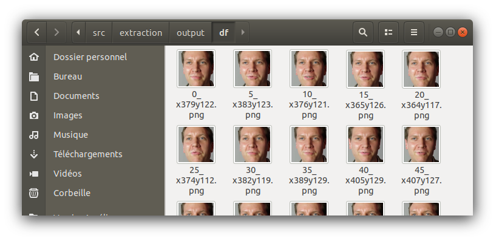

<!--
*** README Template by othneildrew
*** https://github.com/othneildrew
-->

<!-- PROJECT LOGO -->
<br />
<p align="center">
  <h3 align="center">Deepfake detection</h3>
</p>


<!-- TABLE OF CONTENTS -->
## Table of Contents

* [About the Project](#about-the-project)
  * [Built With](#built-with)
* [Getting Started](#getting-started)
  * [Prerequisites](#prerequisites)
  * [Installation](#installation)
* [Quick Start](#quick-start)
* [Usage](#usage)
* [Authors](#authors)
* [Acknowledgements](#acknowledgements)


<!-- ABOUT THE PROJECT -->
## About The Project

The purpose of this project is to detect deepfakes videos thanks to several methods that already exist ([MesoNet](https://github.com/DariusAf/MesoNet), [CapsuleForensics](https://github.com/nii-yamagishilab/Capsule-Forensics-v2)) and include it to the [WeVerify InVID plugin](https://github.com/AFP-Medialab/we-verify-app) project.

This repository includes sources that can be run with the help of Docker tools, to train neural networks and/or use them to detect deepfakes.


### Built With

* [Docker](https://www.docker.com/) - Simplify and Accelerate App Development
* [docker-compose](https://docs.docker.com/compose/) - A tool for defining and running multi-container Docker applications


<!-- GETTING STARTED -->
## Getting Started

To get a local copy up and running, follow these simple steps.

### Prerequisites

**This project has been tested on Linux Ubuntu 18.04.**

- Docker

Make sure Docker is intalled on your environment.
```sh
docker --version
```
If not, install it by following these instructions : [phoenixnap.com - How to install Docker on Ubuntu 18.04](https://phoenixnap.com/kb/how-to-install-docker-on-ubuntu-18-04)
You will also need to install the docker-compose tool.
```sh
sudo curl -L https://github.com/docker/compose/releases/download/1.18.0/docker-compose-`uname -s`-`uname -m` -o /usr/local/bin/docker-compose
sudo chmod +x /usr/local/bin/docker-compose
docker-compose --version
```
You can get the latest version of docker-compose in the documentation : [docs.docker.com - Install Compose](https://docs.docker.com/v17.09/compose/install/#master-builds)


### Installation
 
1. Clone the repository
```sh
git clone https://github.com/laflaurine/imac2-projetTUT.git
cd imac2-projetTUT
```
2. Move into the src directory where you can find the docker-compose.yml file
```sh
cd src
```
3. Run the service of your choice from your console by using the following command:
```sh
sudo docker-compose service_name
```
4. The service should be running and printing results in your console. Make sure you have set-up inputs/outputs folders correctly before running. Make sure you have entered the needed arguments too for the service you want to run.
_For detailed information on how to run each service, please refer to the example usages below._

<!-- QUICK START -->
## Quick start
### Run extraction service
```
sudo docker-compose up extraction_video
```
The service should extract faces from the example video you can find in `src/extraction/input`. When the service end with success, you should see appear some new images in the directory `src/extraction/output` as below :


### Run mesonet_analyse service
```
sudo docker-compose up mesonet_analyse
```
The service should analyse the sample images you can find in `src/extraction/test`. When the service end with success, you should see a prediction printed in your console as below :


### Run capsule_forensics_analyse service
```
sudo docker-compose up capsule_forensics_analyse
```
The service should analyse the sample images you can find in `src/extraction/test`. When the service end with success, you should see a prediction printed in your console as below :


<!-- USAGE EXAMPLES -->
## Usage

- Arguments

The arguments used by each services are declared by defautl in the `.env` file.

You would probably set your own paths when running the services to better fit your working environment. You can modify any of these variables by declaring them when running the command (as you can see below).

- Extraction video

*This service is a useful tool allowing you to extract normalized images that are needed to launch any other services.*
*You can either extract faces from a video that you already have in your computer or download one from YouTube or Facebook thanks to youtube_dl.*

Default arguments:
```sh
video_download=False #Boolean value. Is needed true if you want to download a video  
video_url =https://www.youtube.com/watch?v=gLoI9hAX9dw #Video URL that you want to download
name_video_downloaded=video #Name of the video downloaded
input_path=inputs/video.mp4 # Path to the video you want to analyze
outputs_path=outputs # Path to the folder in which needed normalized images will be stored (outputs of the extraction service)
method_detection=DNN # Can be either DNN or DNN_TRACKING
are_warped=True # Faces will be aligned on the basis of eyes and mouth.
are_culled=True # Faces will be culled according to out-of-bounds landmarks.
are_saved_landmarks=True # Facial landmarks will be saved along with the corresponding face.
```

*Extract a video that you own*

1. Make sure to put the video you want to analyze in a local folder.

2. Run the *extraction_video* service with the following command :
```
sudo video_download=False input_path=your_path_to_the_video/video_name.mp4 outputs_path=your_path_to_your_output_folder docker-compose up extraction_video
```
You can add other arguments following the same model as above.

*Extract a video that you want to download*

1. Make sure to copy the URL from the video that you want.

2. Run the *extraction_video* service with the following command :
```
sudo video_download=True video_url=your_video_url name_video=your_video_name outputs_path=your_path_to_your_output_folder docker-compose up extraction_video
```
You can add other arguments following the same model as above.

- Extraction directory

*This service is a useful tool allowing you to extract all normalized images stored in a directory.*

Default arguments:
```sh
input_path_dir=inputs/ # Path to the directory containing videos
outputs_path=outputs # Path to the folder in which needed normalized images will be stored (outputs of the extraction service)
method_detection=DNN # Can be either DNN or DNN_TRACKING
are_warped=True # Faces will be aligned on the basis of eyes and mouth.
are_culled=True # Faces will be culled according to out-of-bounds landmarks.
are_saved_landmarks=True # Facial landmarks will be saved along with the corresponding face.
```

1. Make sure that you have a local folder filled with video that you want to extract faces.

2. Run the *extraction* service with the following command :
```
sudo input_path_dir=your_path_to_the_directory outputs_path=your_path_to_your_output_folder docker-compose up extraction_dir
```
You can add other arguments following the same model as above.

- MesoNet test

```sh
path_to_dataset=extraction/outputs # Path to the normalized images to analyze
name_classifier=MESO4_DF # Can be 'MESO4_DF', 'MESO4_F2F', 'MESOCEPTION_DF', 'MESOCEPTION_F2F'
batch_size=32 # Size of each batch use for testing
```

*Once you have extract the needed inputs, you can use MesoNet method to detect whether it is a deepfake or not.*

1. Make sure your images in the output folder are saved into subfolders.
Example : `your_path_to_outputs/subfolder/your_images.PNG`

2. Run the *mesonet_test* service with the following command :
```
sudo path_to_dataset=extraction/outputs docker-compose up mesonet_test
```
You can add other arguments following the same model as above.

- MesoNet training

```sh
path_to_dataset=extraction/outputs # Path to the normalized images to analyze
name_classifier=MESO4_DF # Can be 'MESO4_DF', 'MESO4_F2F', 'MESOCEPTION_DF', 'MESOCEPTION_F2F'
number_epochs=10 # Number of epochs
```

*Once you have extract the needed inputs, you can train the MesoNet method with them.*

1. Make sure your images in the output folder are saved into two subfolders : `df` (for the images extracted from deepfake videos) and `real` (for the images extracted from real videos).
Example : `your_path_to_outputs/df/your_deepfake_images.PNG` and `your_path_to_outputs/real/your_real_images.PNG`

2. Run the *mesonet_training* service with the following command :
```
sudo path_to_dataset=extraction/outputs docker-compose up mesonet_training
```
You can add other arguments following the same model as above.

- CapsuleForensics test

```sh
path_to_dataset=extraction/outputs # Path to the normalized images to analyze
```

*Once you have extract the needed inputs, you can use CapsuleForensics method to detect whether it is a deepfake or not.*

1. Make sure your images in the output folder are saved into subfolders.
Example : `your_path_to_outputs/subfolder/your_images.PNG`

2. Run the *capsule_forensics_test* service with the following command :
```
sudo path_to_dataset=extraction/outputs docker-compose up capsule_forensics_test
```
You can add other arguments following the same model as above.

- CapsuleForensics training

```sh
capsule_forensics_train_dataset=extraction/outputs/train # Path to the normalized images for the training of CapsuleForensics
capsule_forensics_test_dataset=extraction/outputs/validation # Path to the normalized images for the training of CapsuleForensics
```

*Once you have extract the needed inputs, you can train the CapsuleForensics method with them.*

1. Make sure your images in the output folder are saved into subfolders.
Example : `your_path_to_outputs/train/subfolder/your_images.PNG` and `your_path_to_outputs/validation/subfolder/your_images.PNG`

2. Run the *capsule_forensics_training* service with the following command :
```
sudo capsule_forensics_train_dataset=extraction/outputs/train  capsule_forensics_val_dataset=extraction/outputs/validation docker-compose up capsule_forensics_training
```

<!-- AUTHORS -->
## Authors

* **Laurine Lafontaine** - [Github](https://github.com/laflaurine)
* **Pierre Thiel** - [Github](https://github.com/piptouque)
* **Manon Sgro'** - [Github](https://github.com/ManonSgro)

<!-- ACKNOWLEDGEMENTS -->
## Acknowledgements
